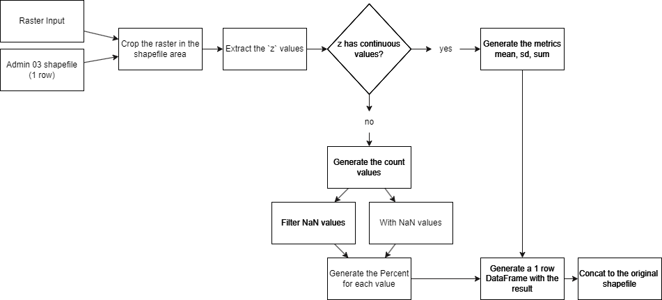
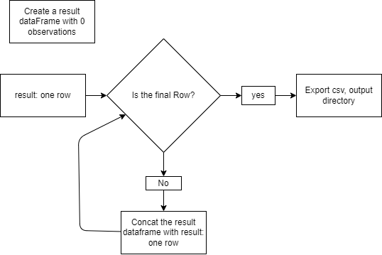

# Ethiopia_Raster_Outcomes

## Environment


### Python

- python version: 3.10.9

```sh
pip install pipenv
pipenv install
```

### Download Data

```sh
python "./src/download/gejson.py"
```

## Data

The data is organized according to the logic and format of the data. The files and directories created that were not present at the beginning of the project were: gjson, Raster, `Shapefiles/9_internet_speed`

```
📂Data
┣ 📂gjson
┃ ┣ 📂okkla
┃ ┃ ┗ 📜ookla_intenet.geojson
┃ ┣ 📜adm_0.geojson
┃ ┣ 📜adm_1.geojson
┃ ┣ 📜adm_2.geojson
┃ ┗ 📜adm_3.geojson
┣ 📂Raster
┃ ┣ 📂ALOS_topoDiversity
┃ ┃ ┗ 📜ethiopia.tif
┃ ┣ 📂ETH_Maternal_and_child_socioeconomic
┃ ┃ ┣ 📜ETH_DECISION_MEAN.tif
┃ ┃ ┣ 📜ETH_DECISION_SD.tif
┃ ┃ ┣ 📜ETH_HWEALTH_MEAN.tif
┃ ┃ ┣ 📜ETH_HWEALTH_SD.tif
┃ ┃ ┣ 📜ETH_MEDUCATION_MEAN.tif
┃ ┃ ┗ 📜ETH_MEDUCATION_SD.tif
┃ ┣ 📂osm
┃ ┃ ┗ 📜eth_osm_dst_road_100m_2016.tif
┃ ┣ 📂Population
┃ ┃ ┗ 📜eth_ppp_2020_constrained.tif
┃ ┣ 📂population_unconstrained
┃ ┃ ┗ 📜eth_ppp_2020.tif
┃ ┣ 📂settlement
┃ ┃ ┣ 📂Each
┃ ┃ ┃ ┣ 📜GHS_BUILT_C_MSZ_E2018_GLOBE_R2023A_54009_10_V1_0_R8_C21.clr
┃ ┃ ┃ ┣ 📜GHS_BUILT_C_MSZ_E2018_GLOBE_R2023A_54009_10_V1_0_R8_C21.tif
┃ ┃ ┃ ┣ 📜GHS_BUILT_C_MSZ_E2018_GLOBE_R2023A_54009_10_V1_0_R8_C21.tif.ovr
┃ ┃ ┃ ┣ 📜GHS_BUILT_C_MSZ_E2018_GLOBE_R2023A_54009_10_V1_0_R8_C21.zip
┃ ┃ ┃ ┣ 📜GHS_BUILT_C_MSZ_E2018_GLOBE_R2023A_54009_10_V1_0_R8_C22.clr
┃ ┃ ┃ ┣ 📜GHS_BUILT_C_MSZ_E2018_GLOBE_R2023A_54009_10_V1_0_R8_C22.tif
┃ ┃ ┃ ┣ 📜GHS_BUILT_C_MSZ_E2018_GLOBE_R2023A_54009_10_V1_0_R8_C22.tif.ovr
┃ ┃ ┃ ┣ 📜GHS_BUILT_C_MSZ_E2018_GLOBE_R2023A_54009_10_V1_0_R8_C22.zip
┃ ┃ ┃ ┣ 📜GHS_BUILT_C_MSZ_E2018_GLOBE_R2023A_54009_10_V1_0_R8_C23.clr
┃ ┃ ┃ ┣ 📜GHS_BUILT_C_MSZ_E2018_GLOBE_R2023A_54009_10_V1_0_R8_C23.tif
┃ ┃ ┃ ┣ 📜GHS_BUILT_C_MSZ_E2018_GLOBE_R2023A_54009_10_V1_0_R8_C23.tif.ovr
┃ ┃ ┃ ┣ 📜GHS_BUILT_C_MSZ_E2018_GLOBE_R2023A_54009_10_V1_0_R8_C23.zip
┃ ┃ ┃ ┣ 📜GHS_BUILT_C_MSZ_E2018_GLOBE_R2023A_54009_10_V1_0_R9_C21.clr
┃ ┃ ┃ ┣ 📜GHS_BUILT_C_MSZ_E2018_GLOBE_R2023A_54009_10_V1_0_R9_C21.tif
┃ ┃ ┃ ┣ 📜GHS_BUILT_C_MSZ_E2018_GLOBE_R2023A_54009_10_V1_0_R9_C21.tif.ovr
┃ ┃ ┃ ┣ 📜GHS_BUILT_C_MSZ_E2018_GLOBE_R2023A_54009_10_V1_0_R9_C21.zip
┃ ┃ ┃ ┣ 📜GHS_BUILT_C_MSZ_E2018_GLOBE_R2023A_54009_10_V1_0_R9_C22.clr
┃ ┃ ┃ ┣ 📜GHS_BUILT_C_MSZ_E2018_GLOBE_R2023A_54009_10_V1_0_R9_C22.tif
┃ ┃ ┃ ┣ 📜GHS_BUILT_C_MSZ_E2018_GLOBE_R2023A_54009_10_V1_0_R9_C22.tif.ovr
┃ ┃ ┃ ┣ 📜GHS_BUILT_C_MSZ_E2018_GLOBE_R2023A_54009_10_V1_0_R9_C22.zip
┃ ┃ ┃ ┣ 📜GHS_BUILT_C_MSZ_E2018_GLOBE_R2023A_54009_10_V1_0_R9_C23.clr
┃ ┃ ┃ ┣ 📜GHS_BUILT_C_MSZ_E2018_GLOBE_R2023A_54009_10_V1_0_R9_C23.tif
┃ ┃ ┃ ┣ 📜GHS_BUILT_C_MSZ_E2018_GLOBE_R2023A_54009_10_V1_0_R9_C23.tif.ovr
┃ ┃ ┃ ┣ 📜GHS_BUILT_C_MSZ_E2018_GLOBE_R2023A_54009_10_V1_0_R9_C23.zip
┃ ┃ ┃ ┣ 📜GHSL_Data_Package_2023_light.pdf
┃ ┃ ┃ ┣ 📜GHSL_Data_Package_2023_light(1).pdf
┃ ┃ ┃ ┣ 📜GHSL_Data_Package_2023_light(2).pdf
┃ ┃ ┃ ┣ 📜GHSL_Data_Package_2023_light(3).pdf
┃ ┃ ┃ ┣ 📜GHSL_Data_Package_2023_light(4).pdf
┃ ┃ ┃ ┗ 📜GHSL_Data_Package_2023_light(5).pdf
┃ ┃ ┣ 📜ethiopia_ghs_masked.tif
┃ ┃ ┣ 📜ethiopia_ghs.tif
┃ ┃ ┗ 📜GHS_BUILT_C_MSZ_E2018_GLOBE_R2022A_54009_10_V1_0.tif
┃ ┗ 📂viirs_100m
┃   ┗ 📜eth_viirs_100m_2016.tif
┣ 📂Shapefiles
┃ ┣ 📂9_internet_speed
┃ ┃ ┗ 📜2020-04-01_performance_fixed_tiles.zip
┃ ┣ 📜_Source.txt
┃ ┣ 📜ET_Admin0_2023.dbf
┃ ┣ 📜ET_Admin0_2023.shp
┃ ┣ 📜ET_Admin1_2023.dbf
┃ ┣ 📜ET_Admin1_2023.shp
┃ ┣ 📜ET_Admin2_2023.dbf
┃ ┣ 📜ET_Admin2_2023.shp
┃ ┣ 📜ET_Admin3_2023.dbf
┃ ┗ 📜ET_Admin3_2023.shp
┣ 📂Woreda-level
┃ ┣ 📂Population
┃ ┃ ┗ 📜eth_admpop_2023.xlsx
┃ ┣ 📜_Data Sources.xlsx
┃ ┗ 📜PSNP_Case load by woreda.xlsx
┣ 📜Banks.xlsx
┣ 📜Kits_Assignment_2023.02.27.xlsx
┣ 📜NIDP Centers_Locations_2023.02.27.csv
┗ 📜NIDP_Administrative Subdivision_2023.02.27_Original.xlsx
```

### Shapefiles

In this directory, there is `Data/Shapefiles/9_internet_speed/2020-04-01_performance_fixed_tiles.zip`, which is a zip file containing a shapefile representing data released by Ookla on internet download and upload speeds worldwide. The processed file for Ethiopia is located at `Data/gjson/okkla/ookla_intenet.geojson`.

### Gjson - GeoJSON files

- `Data/gjson/okkla/ookla_intenet.geojson`: Processed data from Ookla.
- `Data/gjson/adm_0.geojson`: Country-level GeoJSON - Used in raster and data filtering to enhance computational power.
- `Data/gjson/adm_1.geojson`: Level 1 GeoJSON - Not used.
- `Data/gjson/adm_2.geojson`: Level 2 GeoJSON - Not used.
- `Data/gjson/adm_3.geojson`: Level 3 GeoJSON - Used in indicator creation.


### Raster - TIF and TIFF Files

- [`Data/Raster/settlement/GHS_BUILT_C_MSZ_E2018_GLOBE_R2022A_54009_10_V1_0.tif`](https://human-settlement.emergency.copernicus.eu/ghs_buC2023.php): This file delineates the boundaries of human settlements at a 10-meter resolution and describes their inner characteristics in terms of the morphology of the built environment and functional use.
- [`Data/raster/ALOS_topoDiversity/ethiopia.tif`](https://developers.google.com/earth-engine/datasets/catalog/CSP_ERGo_1_0_Global_ALOS_topoDiversity): Topographic diversity (D) represents the variety of temperature and moisture conditions available to species as local habitats. It expresses the logic that a higher variety of topo-climate niches should support higher diversity, especially plant diversity, and support species persistence given climatic change.
- [`Data/Raster/ETH_Maternal_and_child_socioeconomic`](https://hub.worldpop.org/geodata/summary?id=50650)
  - `Eth_HWEALTH_mean.tif`: Proportion of children aged 12 to 23 months born to the poorest/poorer households according to DHS/MICS-NICS classifications.
  - `Eth_MEDUCATION.tif`: Proportion of children born to mothers who had no formal education.
  - `Eth_DECISION.tif`: Proportion of women aged 15 to 49 years who did not participate in decision-making in their households.
- [`Data/Raster/osm/eth_osm_dst_road_100m_2016.tif`](https://hub.worldpop.org/geodata/summary?id=17364): Distance to OpenStreetMap major roads 2015 in Ethiopia at a 100-meter resolution.
- [`Data/Raster/viirs_100m/eth_viirs_100m_2016.tif`](https://hub.worldpop.org/geodata/summary?id=18600): Resampled VIIRS night-time lights data for Ethiopia in 2016 at a 100-meter resolution.
- [`Data/Raster/population_unconstrained/eth_ppp_2020.tif`](https://hub.worldpop.org/geodata/summary?id=6358): Estimated total number of people per grid cell. The dataset is available in Geotiff format at a resolution of 3 arc (approximately 100 meters at the equator). The projection is Geographic Coordinate System, WGS84. The units are the number of people per pixel. The mapping approach is Random Forest-based dasymetric redistribution.

### CSVs 

- [`Data/csvs/buildings/each_google/*.tif`](https://sites.research.google/open-buildings/#open-buildings-dataset-description): CSV files containing observations only for Ethiopia, processed by `notebooks/ref/building_google.ipynb` to obtain a single CSV file, the result of which is located at `Data/csvs/buildings/etiopia_google.csv`.
- `Data/csvs/buildings/etiopia_google.csv`: Final Result.

## Notebooks

```
notebooks
┣ 📂ref
┃ ┣ 📜ghs_result.ipynb
┃ ┗ 📜ookla.ipynb
┃ ┗ 📜building_google.ipynb
┣ 📂types_data
┃ ┣ 📂__pycache__
┃ ┃ ┣ 📜__init__.cpython-310.pyc
┃ ┃ ┣ 📜settlement.cpython-310.pyc
┃ ┃ ┗ 📜utils.cpython-310.pyc
┃ ┣ 📜__init__.py
┃ ┣ 📜settlement.py
┃ ┗ 📜utils.py
┣ 📜__init__.py
┣ 📜0_GHS.ipynb
┣ 📜0_internet.ipynb
┣ 📜0_maternal_chil_socieconomic.ipynb
┣ 📜0_osm_viirs.ipynb
┣ 📜0_shapefiles_pop.ipynb
┗ 📜salem.ipynb
```

### `ref`

Within the notebooks folder, there is a directory named `ref`, which contains 2 files:

- `notebooks/ref/ghs_result.ipynb`: This file outlines the cleaning and transformation procedure for data related to `GHS` and the desired output.
- `notebooks/ref/ookla.ipynb`: This file filters the tiles of Ookla data worldwide to only include data for Ethiopia.

### `type_data`

This is the generated Python package, which includes several files simplifying the following map, representing a single administration from `data/gjson/adm_3.geojson`.



To represent this, we have the file `notebooks/types_data/utils.py` and the class `RasterIOInd`. We can use the `get_result()` method, which performs the following steps:

- `Crop raster`: The method `get_data_raster_shapefiles` extracts the cropped raster.
- `Extract z values`
  - `Continuous variables`: We use the `_raster_to_data` method, which returns metrics of mean, standard deviation, and sum within a single-row dataframe with corresponding row IDs.
  - `Other cases`: We use the `_metric_values` method and the parameter `settlement` in the class, set to true, which returns a dataframe of `n` rows with values in one column and counts of the values in another column.

To iterate over each row and generate an indicator for each and aggregate them into a final result dataframe.



- `Concat result`: We create a dataframe to which we will append each result row from the previous step.
- `GHS`: For this case, we will use `settlement.py`.
  - We use the `join_percent`, `generate_data`, and `join_dummy` methods to obtain all existing categories. By default, it generates 2 types of results (with NaNs and without NaNs).
- `Save Result`:
  - Within each class, there is a `save` parameter which indicates the location of the CSV file to export.

### `Notebooks/.`

- `0_GHS.ipynb`: Works with `Data/Raster/settlement/GHS_BUILT_C_MSZ_E2018_GLOBE_R2022A_54009_10_V1_0.tif` datasets and generates:
  - `output/GHS/ghs_with_na.csv`
  - `output/GHS/ghs_without_na.csv`
  
- `0_internet.ipynb`: Contains little relevant information (nothing exported).

- `0_maternal_chil_socieconomic.ipynb`: When using the package, generating the results is translated into just 3 lines of code:
  - Works with `Data/Raster/ETH_Maternal_and_child_socioeconomic/ETH_DECISION_MEAN.tif` to generate `output/maternal_child_socioeconomic/decision.csv`.
  - Works with `Data/Raster/ETH_Maternal_and_child_socioeconomic/ETH_HWEALTH_MEAN.tif` to generate `output/maternal_child_socioeconomic/hwealth.csv`.
  - Works with `Data/Raster/ETH_Maternal_and_child_socioeconomic/ETH_MEDUCATION_MEAN.tif` to generate `outuput/maternal_child_socioeconomic/economic.csv`.

- `0_osm_viirs.ipynb`: When using the package, generating the results is translated into just 3 lines of code:
  - Works with `Data/Raster/osm/eth_osm_dst_road_100m_2016.tif` to generate `output/osm/distance_osm.csv`.
  - Works with `Data/raster/viirs_100m/eth_viirs_100m_2016.tif` to generate `output/virrs/night_time.csv`.
  - Works with `Data/Raster/ALOS_topoDiversity/ethiopia.tif` to generate `output/Topodiversity/ALOS_topo_diversity.csv`.
  - Works with `Data/Raster/population_unconstrained/eth_ppp_2020.tif` to generate `output/population_unconstrained/population_unconstrained.csv`.

- `0_shapefiles_pop.ipynb`: As one of the early generated files, this served as a basis for building the package:
  - Works with `Data/Raster/Population/eth_ppp_2020_constrained.tif` to generate `output/population/pop.csv`.

- `salem.ipynb`: In an attempt to optimize working time with rasters, the `salem` package was tested, which was much more efficient than `rasterio` in terms of time. However, for large raster files, it is not recommended as it requires a lot of RAM resources:
  - For `Data/Raster/settlement/GHS_BUILT_C_MSZ_E2018_GLOBE_R2022A_54009_10_V1_0.tif`: > 1 TB of RAM.
  - For `Data/Raster/settlement/ethiopia_ghs.tif`: > 98 GB of RAM.

- `0_building_google.ipynb`: 
  - Combines all CSV files into one, considering only the area of Ethiopia (~18 min).
  - Based on other indicators, the code was adapted to generate the indicators (~8 min).

## Output

```
┣ 📂GHS
┃ ┣ 📜ghs_with_na.csv
┃ ┗ 📜ghs_without_na.csv
┣ 📂maternal_child_socioeconomic
┃ ┣ 📜decision.csv
┃ ┣ 📜education.csv
┃ ┗ 📜hwealth.csv
┣ 📂osm
┃ ┗ 📜distance_osm.csv
┣ 📂population
┃ ┗ 📜pop.csv
┣ 📂population_unconstrained
┃ ┗ 📜population_unconstrained.csv
┣ 📂Topodiversity
┃ ┗ 📜ALOS_topo_diversity.csv
┣ 📂google_areas
┃ ┗ 📜google_metrics.csv
┗ 📂virrs
  ┗ 📜night_time.csv

```


### IDs

For the generation of the ID, the following columns are taken into consideration, which are within the original information of `data/gjson/adm_3.geojson` and will be horizontally merged with the metrics.

```python
"id", "fnid", "parent_id", "admin_0", "admin_1", "admin_2", "admin_3",
```

### Non-Continuous Variables

For non-continuous variables, the following column format generated from the raster is used, where the percentage of that category within the area is obtained.

```python
# Example
variable_name = "ghs`
# Indicator columns
values = [1, 2, 3, 4, 5, 11, 12, ...]

new_cols = [f'{variable_name}_{x}' for x in values]
new_cols
# [ghs_1, ghs_2, ghs_3, ...]
```

#### Settlement


```
┣ 📜ghs_with_na.csv
┗ 📜ghs_without_na.csv
```


For the particular case of `GHS`, its documentation states that the value of 255 is considered NA.

- Filtering NA values

| index | id     | fnid          | parent_id | admin_0  | admin_1 | admin_2 | admin_3 | ghs_1            | ghs_2            | ghs_3            | ghs_4 | ghs_5            | ghs_11           | ghs_12           | ghs_13           | ghs_14 | ghs_15 | ghs_21 | ghs_22 | ghs_23 | ghs_24 | ghs_25 |
|-------|--------|---------------|-----------|----------|---------|---------|---------|------------------|------------------|------------------|-------|------------------|------------------|------------------|------------------|--------|--------|--------|--------|--------|--------|--------|
| 112.0 | 222908 | ET2023A3020207| 222703    | Ethiopia | Afar    | Kilbati | Afdera  | 54.98789691015236| 0.1594760074042432| 0.002847785846504343| 0.0   | 0.44995016374768615| 44.39982913284921| 0.0              | 0.0              | 0.0    | 0.0    | 0.0    | 0.0    | 0.0    | 0.0    | 0.0    | 
| 761.0 | 223557 | ET2023A3050503| 222748    | Ethiopia | Somali  | Korahe  | Shilabo | 44.10304625799172| 10.851447912749155| 0.30763444904099285 | 0.0   | 0.051147047762316655| 40.89883414817601| 2.0985332831891688| 1.6893569010906355| 0.0    | 0.0    | 0.0    | 0.0    | 0.0    | 0.0    | 0.0    | 
| 797.0 | 223593 | ET2023A3050901| 222752    | Ethiopia | Somali  | Liben   | Filtu   | 16.74891992038964| 35.83113541852074| 3.195741169236744  | 0.0   | 0.4611575864468213  | 39.26150062296727| 2.059837219462468 | 2.4417080629763275| 0.0    | 0.0    | 0.0    | 0.0    | 0.0    | 0.0    | 0.0    | 


- Considering NA values

| index | id     | fnid          | parent_id | admin_0  | admin_1 | admin_2 | admin_3 | ghs_1           | ghs_2           | ghs_3            | ghs_4 | ghs_5           | ghs_11          | ghs_12          | ghs_13          | ghs_14 | ghs_15 | ghs_21 | ghs_22 | ghs_23 | ghs_24 | ghs_25 | ghs_255         |
|-------|--------|---------------|-----------|----------|---------|---------|---------|-----------------|-----------------|------------------|-------|-----------------|-----------------|-----------------|-----------------|--------|--------|--------|--------|--------|--------|--------|-----------------|
| 112.0 | 222908 | ET2023A3020207| 222703    | Ethiopia | Afar    | Kilbati | Afdera  | 0.024064201180061865 | 6.97910438698775e-05 | 1.2462686405335268e-06 | 0.0   | 0.0001969104452042972 | 0.019430574374558213 | 0.0               | 0.0               | 0.0    | 0.0    | 0.0    | 0.0    | 0.0    | 0.0    | 0.0    | 99.95623727668766 |
| 761.0 | 223557 | ET2023A3050503| 222748    | Ethiopia | Somali  | Korahe  | Shilabo | 0.06264879958019161  | 0.01541458568335336  | 0.00043699768104883376  | 0.0   | 7.265487117682321e-05  | 0.058097185591761205 | 0.0029809866262255407| 0.002399


## R

These are R files, which were used for comparison with Python. As a result, it was noticed that R was faster in this procedure.

- `etiopia_settlement.r`: Generates the 2 GHS files only for Ethiopia.
- `time_raster.r`: Generates the time it takes for R to process and generate the R indicators (it's faster than Python).

## src

Generates the necessary source files, mainly the files `Data/gjson/adm_0.geojson`, `Data/gjson/adm_1.geojson`, `Data/gjson/adm_2.geojson`, `Data/gjson/adm_3.geojson`.

# Advices

- Corrupted source files `Data/Shapefiles/*.shp` (a `.shp` file comes along with the following files `.shx, .prj, .dbf`), were replaced by generation through queries to the `api`, check `src/download/gejson.py` which generates, among others, the management files and saves them in `Data/gjson/*.geojson`.
- Several files within the `Data/Raster` folder are manually downloaded data.
- Settlement
  - Files within `Data/Raster/settlement/Each/*` were downloaded tile by tile to generate a 10m GHS raster for Ethiopia only, but it couldn't be generated due to lack of computing power.
  - The files `Data/Raster/settlement/ethiopia_ghs.tif, Data/Raster/settlement/ethiopia_ghs_masked.tif` were generated with R, using the `terra` and `sf` packages as they were more optimized in resource usage.
- Attempt of resource optimization with salem not possible as it requires a lot of RAM resources, which are not available.
- `notebooks/ref/building_google.ipynb` (~30 min): to run this notebook, >= 29gb of available RAM is required.